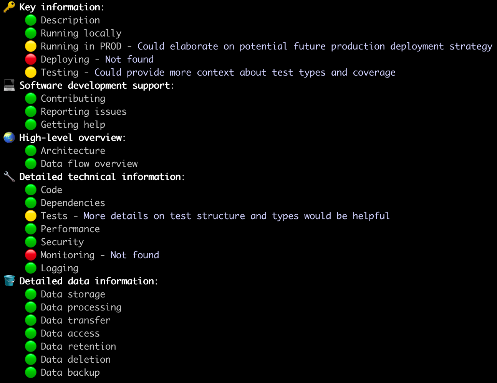
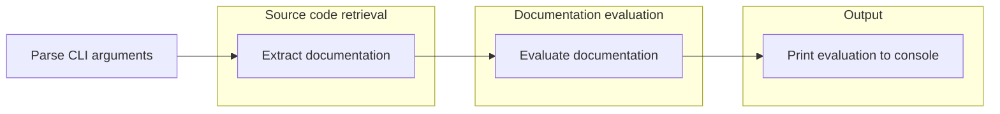
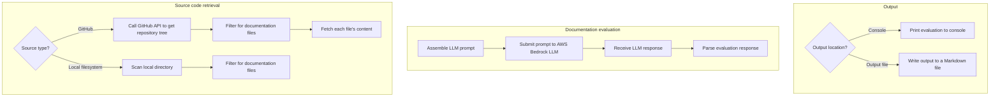

Ever-elusive kudo
=================

This is a tool for evaluating developer documentation. Our goal is to help teams decide whether their developer documentation will be useful for colleagues around the department.

## Running

### Locally

This tool can be run locally using `sbt`.

Looking up documentation from GitHub requires a GitHub API token (with the read content scope), which should be provided as an environment variable. AWS Bedrock is authenticated using AWS credentials in a named profile.

    $ GITHUB_API_KEY=??? sbt
    > run --github guardian/hackday-ever-elusive-kudo --bedrock-profile aws-profile --region us-east-1

The program takes a few parameters, some of which have default values. You must provide one of either `--github` or `--local` to specify the codebase for evaluation.

| Argument                               | Description                                                                                                       |
|----------------------------------------|-------------------------------------------------------------------------------------------------------------------|
| --github &lt;owner/repo&gt;            | Use a GitHub repository as the source code provider: `owner/repository` e.g. `guardian/hackday-ever-elusive-kudo` |
| [ --git-ref &lt;value&gt; ]            | **Optional**: A reference to the version of the GitHub repository to check (default: `main`)                      |
| --local &lt;directory&gt;              | Select a local directory as the source code provider e.g. `/Users/user/code/hackday-ever-elusive-kudo`            |
| --bedrock-profile / -p &lt;profile&gt; | The AWS profile name that contains valid credentials for calling AWS Bedrock                                      |
| --region &lt;region&gt;                | **Optional**: The AWS region that should be used to call the AWS Bedrock API (default: `us-east-1`)               |
| --output-file / -o &lt;file&gt;        | **Optional**: Write the evaluation to the specified file in markdown format e.g. `output.md`                      |
| --verbose / -v                         | Prints the LLM's reasoning in addition to its evaluation, to explain its thinking                                 |

### Production

This is a hack day project, and doesn't currently have any deployment.

In the future, this will likely be invoked from a CI/CD as a GitHub workflow.

## Contributing

Contributions are welcome, this repository allows Pull Requests from colleagues.

### Support / issues

Please get in touch with [@adamnfish](https://github.com/adamnfish), or open an issue on this repository.

## Architecture

Ever-elusive kudo is a CLI tool, written in Scala. The entrypoint is in [Main.scala](src/main/scala/com/adamnfish/eek/Main.scala),
which assembles and runs the actual CLI program.

The program is made from two 'services'.

There is a [SourceCode](src/main/scala/com/adamnfish/eek/sourcecode/SourceCode.scala) service, which is used to look up documentation files. This service is implemented by:
- [`Github`](src/main/scala/com/adamnfish/eek/sourcecode/Github.scala), which is used to fetch documentation files from a GitHub repository.
- [`Filesystem`](src/main/scala/com/adamnfish/eek/sourcecode/Filesystem.scala), which gets documentation files from a local directory.

The second service is a [DocsEvaluator](src/main/scala/com/adamnfish/eek/docs/DocsEvaluator.scala), which checks the documentation produced in the previous step. This service is implemented by [`AwsBedrockDocsEvaluator`](src/main/scala/com/adamnfish/eek/docs/AwsBedrockDocsEvaluator.scala), which uses an LLM provided by AWS Bedrock to evaluate the repository's documentation.

Here's an overview of the program:

 and this expands on the highlighted boxes above:

## Technical details

### Dependencies

This is a Scala project using sbt so dependencies should be kept up to date by Scala Steward, with security checks provided by dependabot. Because this is a hack day project, this is not yet in place.

### Testing

The tests can be run using `sbt`.

    $ sbt
    > test

The program can also be run locally to do an end-to-end check that it is working, using the instructions above.

### Integration tests

The integration tests use test versions of the application's components, and are automatically run with the other tests. 

There is an additional integration test for end-to-end testing the AWS Bedrock documentation evaluation, [BuildDocsEvaluator](src/test/scala/com/adamnfish/eek/integration/BuildDocsEvaluator.scala). This requires a valid AWS profile and actually hits the Bedrock API. It is useful for iterating on the LLM prompt, to get the best possible results out of the evaluation. To run this test remove `.ignore` from the test description string.

### Performance

The tool makes calls to GitHub and then passes the results to AWS Bedrock for evaluation. LLMs are very slow to respond, so this program will take tens of seconds to complete.

There are two sequential GitHub API calls, the first to fetch the tree and then another set in parallel to look up the documentation file contents.

We then pass this data to AWS Bedrock.

### Security

Keys required to authenticate this application are kept out of the repository and away from the terminal during invocation. The GitHub API key (if used) is provided via an environment variable, and the AWS credentials are provided using a named profile.

The provided GitHub Access token determines what GitHub data is accessible to the tool and the AWS profile that's used determines whether the program can call AWS Bedrock.

### Observability

Detailed runtime logs are saved in the `logs` directory of this project.

No monitoring strategy exists for this locally executed hack day project. When in production, the execution time and Bedrock costs will be the key metrics to consider.

## Data

Ever-elusive kudo reads documentation data from GitHub or from a local directory, and passes it to an LLM in AWS Bedrock for evaluation. The results of this evaluation are then printed to the console.

Detailed runtime logs are written to the `logs` directory, which may contain:
- the contents of the documentation files
- the prompt sent to the LLM
- the full response from the LLM

Avoid using documentation files that contain anything that you are uncomfortable sending to AWS Bedrock.

The logs are excluded from the repository via the .gitignore, and engineers should be cautious not to accidentally share the log file if the documentation files are sensitive.

Since this program has no data of its own, there is no need to consider data backups.
