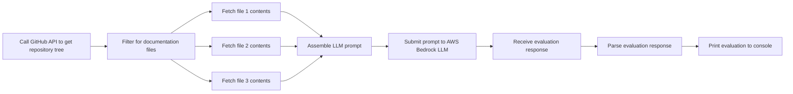

Ever-elusive kudo
=================

This is a tool for evaluating developer documentation. Our goal is to help teams decide whether their developer documentation will be useful for colleagues around the department.

## Running

### Locally

This tool can be run locally using `sbt`.

It requires a GitHub API token and an AWS profile with access to AWS Bedrock. The GitHub API key should be provided as an environment variable and the AWS credentials should be in a named profile.

    $ GITHUB_API_KEY=??? sbt
    > run --owner guardian --repo hackday-ever-elusive-kudo --profile aws-profile --git-ref main --region eu-west-1

The program takes a few parameters, some of which have default values:

| Argument  | Description                                                                                         |
|-----------|-----------------------------------------------------------------------------------------------------|
| --owner   | The GitHub organisation or user that owns the repository (e.g. `guardian` or `adamnfish`)           |
| --repo    | The GitHub repository name, taken from its URL (e.g. `everhackda-ever-elusive-kudo`)                |
| --profile | The AWS profile name that contains valid credentials for calling AWS Bedrock                        |
| --git-ref | **Optional**: A reference to the version of the repository to check (default: `main`)               |
| --region  | **Optional**: The AWS region that should be used to call the AWS Bedrock API (default: `us-east-1`) |

### Production

This is a hack day project, and doesn't currently have any deployment.

In the future, this will likely be invoked from a CI/CD as a GitHub workflow.

## Contributing

Contributions are welcome, this repository allows Pull Requests from colleagues.

### Support / issues

Please get in touch with [@adamnfish](https://github.com/adamnfish), or open an issue on this repository.

## Architecture

Ever-elusive kudo is a CLI tool, written in Scala. The entrypoint is in [Main.scala](src/main/scala/com/adamnfish/eek/Main.scala),
which assembles and runs the actual CLI program.

The program is made from two 'services'.

There is a [VcsInformation](src/main/scala/com/adamnfish/eek/vcs/VcsInformation.scala) service, which is used to look up documentation files. This service is implemented by the [`Github`](src/main/scala/com/adamnfish/eek/vcs/Github.scala) class, which is used to fetch documentation files from a GitHub repository.

The second service is a [DocsEvaluator](src/main/scala/com/adamnfish/eek/docs/DocsEvaluator.scala), which checks the documentation produced in the previous step. This service is implemented by [`AwsBedrockDocsEvaluator`](src/main/scala/com/adamnfish/eek/docs/AwsBedrockDocsEvaluator.scala), which uses the an LLM provided by AWS Bedrock to evaluate the repository's documentation.

## Technical details

### Dependencies

This is a Scala project using sbt so dependencies should be kept up to date by Scala Steward, with security checks provided by dependabot. Because this is a hack day project, this is not yet in place.

### Testing

The tests can be run using `sbt`.

    $ sbt
    > test

The program can also be run locally to do an end-to-end check that it is working, using the instructions above.

### Integration tests

There is an additional integration test for end-to-end testing the AWS Bedrock documentation evaluation, [BuildDocsEvaluator](src/test/scala/com/adamnfish/eek/integration/BuildDocsEvaluator.scala). This requires a valid AWS profile and actually hits the Bedrock API. This is useful for iterating on the LLM prompt, to get the best possible results out of the evaluation. 

### Performance

The tool makes calls to GitHub and then passes the results to AWS Bedrock for evaluation. LLMs are very slow to respond, so this program will take multiple seconds to complete.

There are two sequential GitHub API calls, the first to fetch the tree and then another set in parallel to look up the documentation file contents.

We then pass this data to AWS Bedrock.

### Security

Keys required to authenticate this application are kept out of the repository. The GitHub API key is provided via an environment variable, and the AWS credentials are provided using a named profile.

The provided GitHub Access token determines what GitHub data is accessible to the tool and the AWS profile that's used determines whether the program can call AWS Bedrock.

### Observability

Detailed runtime logs are saved in the `logs` directory of this project.

No monitoring strategy exists for this locally executed hack day project. When in production, the execution time and Bedrock costs will be the key metrics to consider.

## Data

Ever-elusive kudo reads documentation data from GitHub, and passes it to an LLM in AWS Bedrock for evaluation. The results of this evaluation are then printed to the console.

Detailed runtime logs are written to the `logs` directory. These logs contain the contents of the documentation files that were fetched from GitHub. The documentation files should not contain any sensitive information, and in many cases are publicly accessible. However, these logs are excluded from the repository via the .gitignore, and engineers should be cautious not to accidentally share the log file.

Since this program has no data of its own, there is no need to consider data backups.
